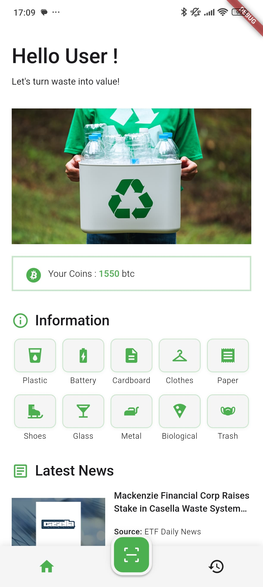
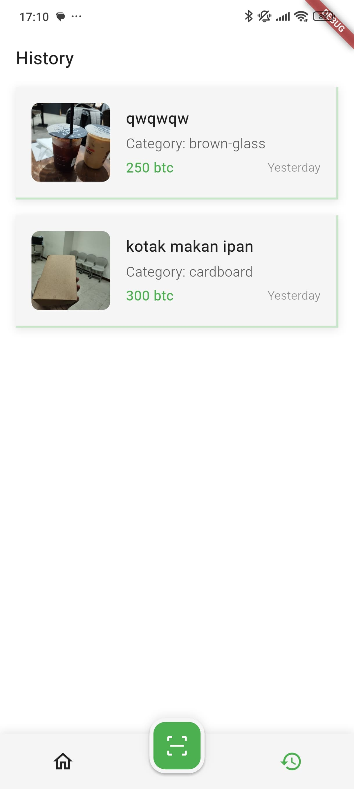

# rubisch ♻️

A Flutter-based mobile application that turns trash into treasure. Using a custom-built Machine Learning model, **rubisch** identifies different types of waste through your camera and rewards you with virtual currency for your recycling efforts.

-----

## 📸 Screenshots

| Homepage                                     | History Page                                     |
| -------------------------------------------- | ------------------------------------------------ |
|  |  |
| The homepage displays your total coin balance, provides information on different trash categories, and shows the latest news articles on waste and recycling. | The history page keeps a record of all your previously scanned items for easy reference. |

-----

## ✨ Features

  * **📷 Live Trash Scanning:** Uses the device camera to scan and identify waste items in real-time.
  * **🧠 Intelligent Detection:** Powered by a custom TensorFlow Lite model (MobileNetV2) to accurately classify up to 12 different categories of trash.
  * **💰 Coin Reward System:** Earn virtual "btc" for every piece of trash you scan, with different values for each category.
  * **📜 Scan History:** A local database stores a complete history of all your scanned items.
  * **📰 Waste & Recycling Articles:** Stay informed with the latest news on environmental topics, powered by the News API.

-----

## ⚙️ The Technology Behind Rubisch

This project is not just a simple app; it integrates a custom-built machine learning model to perform its core function.

### Machine Learning Model

The detection model was trained from scratch using the following methodology:

  * **Dataset:** [12 Class Trash Classification](https://www.kaggle.com/datasets/mostafaabla/garbage-classification) dataset from Kaggle.
  * **Algorithm:** A Convolutional Neural Network (CNN) architecture.
  * **Base Model:** Leveraged **MobileNetV2** for efficient performance on mobile devices.
  * **Framework:** Built with **TensorFlow** and exported to the **TensorFlow Lite (`.tflite`)** format for seamless integration into the Flutter app.

-----

## 🚀 Getting Started

To get a local copy up and running, follow these simple steps.

### Prerequisites

  * Flutter SDK installed on your machine.
  * A code editor like VS Code or Android Studio.

### Installation

1.  **Clone the repository:**
    ```bash
    git clone https://github.com/your-username/rubisch.git
    ```
2.  **Navigate to the project directory:**
    ```bash
    cd rubisch
    ```
3.  **Install dependencies:**
    ```bash
    flutter pub get
    ```
4.  **Set up Environment Variables:**
    Create a file named `.env` in the root of the project folder and add your News API key.
    ```.env
    NEWS_API_KEY=<your api key>
    CATEGORY=waste+recycling
    SORT_BY=publishedAt
    ```
5.  **Run the Build Runner:**
    This command generates necessary files for the project's dependencies.
    ```bash
    flutter pub run build_runner build --delete-conflicting-outputs
    ```
6.  **Run the app:**
    ```bash
    flutter run
    ```

-----

## 🧑‍💻 Contributors

This project was brought to life by a team of dedicated developers:

  * **Lfiathan:** ML model creation, TensorFlow implementation, camera feature, and CRUD database logic.
  * **Rifkialaudin:** Trash information logic, history page functionality, and coin management system.
  * **ivanrhmt77:** UI/UX design, UI slicing from design to code, and News API implementation.

-----

## 📄 License

This project is licensed under the MIT License. See the `LICENSE` file for more details.
